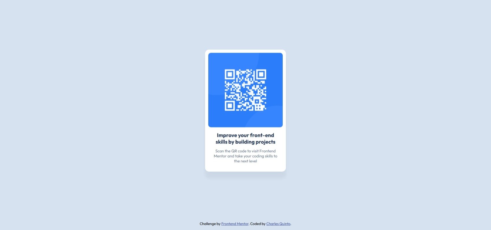

# Frontend Mentor - QR code component solution

This my personal solution to the [QR code component challenge on Frontend Mentor](https://www.frontendmentor.io/challenges/qr-code-component-iux_sIO_H). 

## Table of contents

- [Overview](#overview)
  - [Screenshot](#screenshot)
  - [Links](#links)
- [My process](#my-process)
  - [Built with](#built-with)
  - [What I learned](#what-i-learned)
  - [Continued development](#continued-development)
  - [Useful resources](#useful-resources)
- [Author](#author)

## Overview

This project took me an estimated time of 90 minutes to accomplish. The challenges I encountered were forgetting the semantic aspect of the html tags. In addition to this, the estimation of of the accuracy according to the appropriate dimensions of the project were done by trial and error. The biggest challenge I also encountered is keeping the code consice and avoiding repetition as I still am brushing up on my skills.

### Screenshot



Here's a screenshot of my solution. You may visit the website below to confirm its legitimacy.

### Links

- Live Site URL: (https://charlesremarks.github.io/QrCodeWebDevPractice/)

## My process

1. The process in which this project was done was first configuring the different elements required for the website beginning with the semantic html elements. 
2. Afterwards I made use of CSS custom properties to edit and adjust the different components of the website. 
3. The flexbox main use was to center the content of the website in the middle of the page.

### Built with

- Semantic HTML5 markup
- CSS custom properties
- Flexbox

**Note: These are just examples. Delete this note and replace the list above with your own choices**

### What I learned

I learnt that in order to replicate a websites overall design may be almost impossible without the specific measurements given; however, you may use precision to your advantage to make the website be as near identical to the target product. 

In which case, this portion of the css stylesheet is my proudest part of this endeavour as this is the main card of the project that made it identical to the target product.

```css
.qrcard {   
  background-color: hsl(0, 0%, 100%);
  border-radius: 12px;
  margin: 0 auto;
  text-align: center;
  width: 225px;
  height: 350px;
  padding: 10px;
  box-shadow: 0px 20px 10px rgba(0, 0, 0, 0.048)
}
```

### Continued development

There definitely needs to be refinement with my understanding of different CSS concepts especially such as the uses of the flexbox display as well as the use of CSS grids. Furthermore, I also have to brush up on my html semantics in order to improve the readability of my code. 

### Useful resources

- [w3schools](https://www.w3schools.com/) - This website helped provide most of the common syntax needed for the project.
- [MDN Web Docs](https://developer.mozilla.org/en-US/) - This is an amazing website that visualizes the different CSS custom properties.

## Author

- Website - [Charles Quinto]
- Frontend Mentor - [@CharlesRemarks](https://www.frontendmentor.io/profile/yourusername)